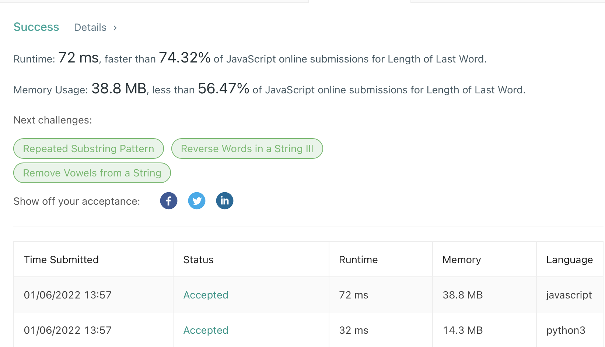

## 
Length of last word

#### 
📚 _LeetCode Problem #58 (**Level Easy**) 01/06/2022_ 

**_
By Daniel Adeyemi_**

---

## 
 🚩 _Description_:

##### **_This is solutions for Leet Code problem [# 58 "Length Of Last Word"](https://leetcode.com/problems/length-of-last-word/)._**

### 
 🤔 Problem description:

Given a string s consisting of some words separated by some number of spaces, return the length of the last word in the string.

A word is a maximal substring consisting of non-space characters only.

## 
 🚥 Tests

## 
 🛠️ _Technologies used:_

- Python 3.9
- JavaScript

## 
 🌟 _Teaching points:_

- make sure to remove all white spaces before and after string
- then we can use while loop starting from the end of the string until first white space or beginning of the string
- this is **O(n)** time complexity because it could be the first and only word so we need to loop through the whole string

## 
 📬 Contact Information

#### For any questions _[email author](mailto:adeyemidany+github@gmail.com?subject=[GitHub])_

## 
 📘 _License and copyright:_

> **_© Daniel Adeyemi, 2022_**  
> ⚖️ __
